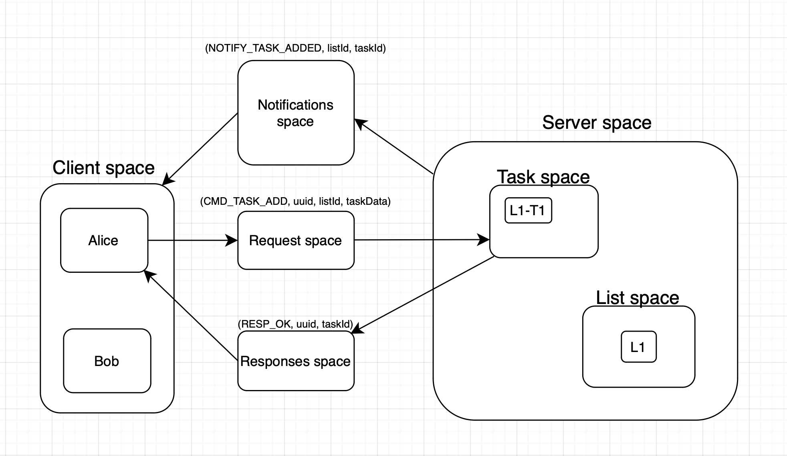
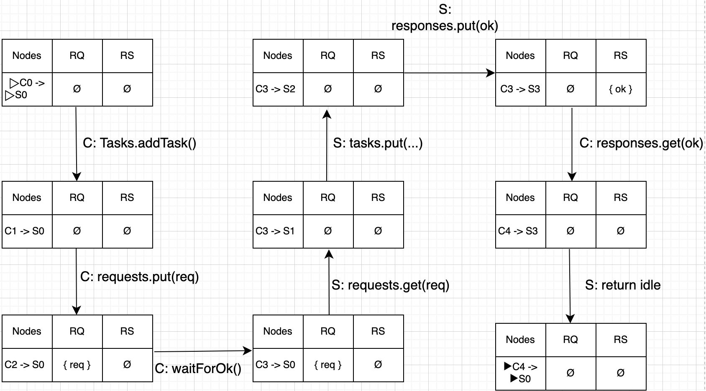

# Project Gr.13 - To do list

# Abstract

This project is a multi-user todolist / task manager that support multiple shared to-do lists with tasks. Users can access all lists, create lists, and collaboratively create tasks, assign or reassign ownership, update task status, due date and more. The system is consistent under concurrent access by multiple clients.

# Contributors

Project contributors:
* Patrick Røbel (s194870@dtu.dk)
* Johan Holm Hansen (s226898@dtu.dk)
* Kajsa Alice Ulrika Berlstedt (s235271@dtu.dk)
* Lizette Bloch Dahl Nikolajsen (s235225@dtu.dk)

All group members participated equally throughout the project. We used mob- or pair programming for initial development of the project or tricky problems where we needed to help each other more and split up tasks when we could work in parallel for better efficiency. Everyone helped with ideas, code reviews, and testing to make sure everything worked together.

## Division of Main Responsibilities

The table below shows the primary responsibility areas for each team member. Note that while each member had main ownership of specific components, most of the time everyone helped generating ideas, developing the final solutions and checking the commits and new implementations to the project.

### Frontend Responsibilities

| Component | Main responsible |
|-----------|------------------|
| Scene navigation and screen transitions | Patrick |
| Login screen and user selection | Lizette |
| Main menu list view | Patrick |
| Task detail view and task editing | Kajsa |
| Add new task dialog | Kajsa |
| Add new list dialog | Lizette |
| Delete confirmations and alerts | Patrick |
| Sorting and filtering tasks | Johan |

### Backend Responsibilities

| Component | Main responsible |
|-----------|------------------|
| Server handler and request processing | Johan & Patrick |
| Add task operation | Kajsa |
| Delete task operation | Kajsa |
| Delete list operation | Lizette |
| Update task status/due-date/owner | Everyone |
| Handle connect/disconnect/login/logout | Johan & Patrick |
| Multiple computers setup | Johan & Patrick |
| Notification broadcast system | Johan & Patrick |

# Demo video
Here is a demo video that shows how our program runs and works on multiple computers. All clients are able to connect to the server easily and use all the functionalities simultaneously.

Demo video: https://www.youtube.com/watch?v=BzKE86eO7-s

# Main coordination challenge

The main challenge we solved was ensuring correct synchronization between client and server. The client blocks while waiting for an OK response, guaranteeing that all state changes are performed by the server before the client continues. This prevents the client from accessing or modifying the spaces directly, and enforces clear separation of responsibilities. This follows the request-response coordination pattern and relies on blocking operations on tuple spaces, as discussed in the lecture slides about concurrent and interaction-oriented programming.

*Figure 1: Communication flow showing tuple spaces involved when creating and assigning a task.* 

The diagram above shows how the system coordinates when Alice creates a new task. First, Alice puts a request tuple `(CMD_TASK_ADD, uuid, listId, taskData)` into the Request space. The server continuously monitors this space and retrieves the request. The server then creates the task and stores it in the Task space (L1-T1). After storing the task, the server does two things: it sends a response tuple `(RESP_OK, uuid, taskId)` back to the Responses space, which Alice is waiting for using the matching UUID. At the same time, the server broadcasts a notification tuple `(NOTIFY_TASK_ADDED, listId, taskId)` to the Notifications space. This notification is picked up by all connected clients including Bob, so everyone sees the new task appear in real-time. This dual mechanism ensures Alice gets confirmation that her operation succeeded while keeping all other users synchronized with the latest data. In order for all clients to get the update without polling, we use get/put commands with a timestamp check created by the server, such that all clients gets the new update and puts it back to the responses space where the rest of the clients can get it. All this happens almost instantly and also ensures that all clients updates only the necessary things and the correct time without checking nonstop which would be CPU expensive.

*Figure 2: Labeled Transition System showing state transitions when a client adds a task to the server.*
### Two concurrent processes:
* Client (C)
* Server (S)
### Node explanation:
#### Client nodes
* C0: before Tasks.addTask
* C1: before requests.put
* C2: after requests.put
* C3: waiting in waitForOk
* C4: request completed
#### Server nodes
* S0: idle, waiting for request
* S1: handling request
* S2: after storing task
* S3: response sent
#### Explanation of {req} and {ok}:
* req = AddTask(requestId, listID, title, dueDate, owner)
* ok = Ok(requestID)
#### Shared states:
* RQ: request channel
* RS: response channel
#### Global state - The tuple: (pc_C, pc_s, RQ, RS)
* where pc_C is client control location, pc_S is server control location, RQ is the set of pending requests, RS is the set of pending responses.
#### Execution:
* The client blocks in control location C3 until ok ∈ RS

---

# Programming language and coordination mechanism

The code is written in Java and uses Javafx as simple frontend/display and the the project is based on the tuple space library jSpace.

# Installation and how to run
* clone repository to your computer
* Install jSpace from https://github.com/pSpaces/jSpace (follow instructions inside link)
* Ensure you have java JDK 17: brew install openjdk@17
* Ensure you have maven installed: brew install maven
* When running the project:
    * From root:
        * mvn clean install
        * to start server: mvn -pl server exec:java
        * to start client: mvn -pl client javafx:run
    * Remember to change IP in "config.java" located in shared/src/main/java/dk/dtu/shared
* See HOWTORUN.TXT for more information.

# References 
* Lecture 1-3 slides on Distributed Systems - by Alberto Lluch Lafuente.
* jSpace documentation and examples: https://github.com/pSpaces/jSpace